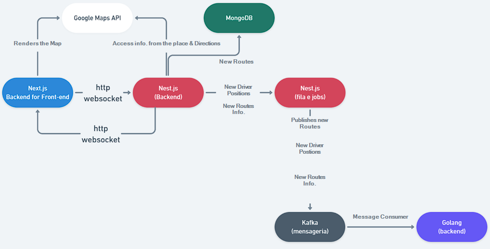

# Case: Vehicles Tracking
Projects in this repo create a vehicles tracking platform. The platform will be able to trace the vehicles in real time and store the trace in the database.  
It will calculate vehicles fares based on the distance that vehicles will travel.  
If the projects had CI/CD they should have their own repositories. Therefore, they could be deployed independently, by git webhooks or other tools.

## Architecture
  

## Technologies
- [Docker](https://docs.docker.com/)
- [Go](https://go.dev/doc/)
- [TypeScript](https://www.typescriptlang.org/docs/)
- [Next.js](https://nextjs.org/docs)
- [Nest.js](https://docs.nestjs.com/)
- [Prometheus](https://prometheus.io/docs/introduction/overview/)
- [Grafana](https://grafana.com/docs/grafana/latest/)
- [Apache Kafka](https://kafka.apache.org/documentation/)
- [MongoDB](https://docs.mongodb.com/)
- [Prisma ORM](https://www.prisma.io/docs/)
- [Google Maps API](https://developers.google.com/maps/documentation)
- [Material UI](https://material-ui.com/getting-started/installation/)
- [Redis](https://redis.io/documentation)

## Projects
### Vehicles Tracking Interface 
The **Next.js** framework show the interface vehicles routes and where they are after the trip started; also is _Backend For FrontEnd_(BFF).  

#### Setup
Commands used to bootstrap the project.  
```bash
npx create-next-app --typescript
```
#### Usage
Start the application:  
```bash
cd nextjs-bff
npm install
npm run dev
```

### API
The **Nest.js** framework provide the API for the platform, having features like: Redis as storage for job queues to have better resilience, WebSockets for real time full-duplex communication between the API and BFF.  
You will need to create a file called `.env` at the root of the project and an account at google to use the maps API like this:  
`GOOGLE_MAPS_API_KEY = <YOUR_GOOGLE_MAPS_API_KEY>`  

#### Setup
Commands used to bootstrap the project.  
```bash
npm install -g @nestjs/cli
nest new nestjs-api
cd nestjs-api 
npm install @prisma/client
npx prisma init #Change the .env file the prisma file.
npx prisma generate # This command must be executed every time that schema.prisma is changed.
npx nest generate module prisma
npx nest generate service prisma
npx nest generate resource # Create the CRUD of routes.
npx nest generate module maps
npx nest generate controller maps/places
npx nest generate service maps/places
npx nest generate controller maps/directions
npx nest generate service maps/directions
npx nest generate service routes/routes-driver
npx nest generate gateway routes/routes-websocket
```

#### Usage
Using the API with Docker Compose:
```bash
cd nestjs-api
docker compose down --volumes
docker compose up --build
```
Access http://localhost:3000/routes.  
There is a file at the root of the project that is called `api.http` that you can use to test the application with the plugin of VSCode called [REST Client](https://marketplace.visualstudio.com/items?itemName=humao.rest-client).  
When the request is made, Nest.js will consume the request/message and show it on the console.  
You can use Prisma Studio to see the data in the database.  
```bash
npx prisma studio
```

#### Tests
```bash
# unit tests
$ npm run test
# e2e tests
$ npm run test:e2e
# test coverage
$ npm run test:cov
```
### Apache Kafka
The Apache Kafka is a message broker that will be used to send messages between the microservice and the API.

#### Usage
Using the Apache Kafka with Docker Compose:
```bash
cd kafka
docker compose down # Run this command to clean files that may generate errors in the next command.
docker compose up
```

### Vehicles Fares Microservice
The microservice calculate the fares of vehicles based on the distance of the route, that the vehicles will travel.  

### Dashboards & System Metrics
The dashboards are made by the application Grafana and the metrics collected by Prometheus.  

## Authors and acknowledgment
Thanks to the professors of [full cycle course](https://github.com/devfullcycle/imersao14) that helped to create and bootstrap this project. 